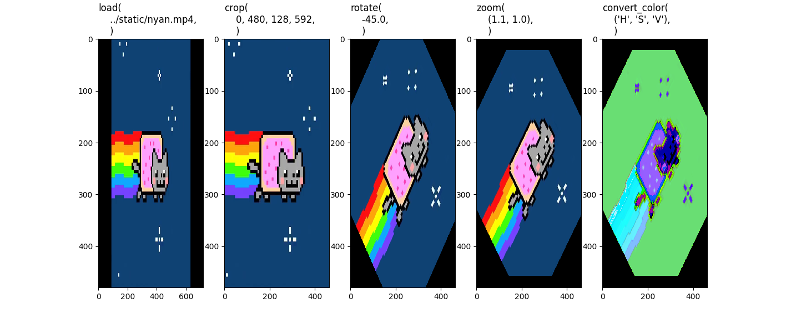
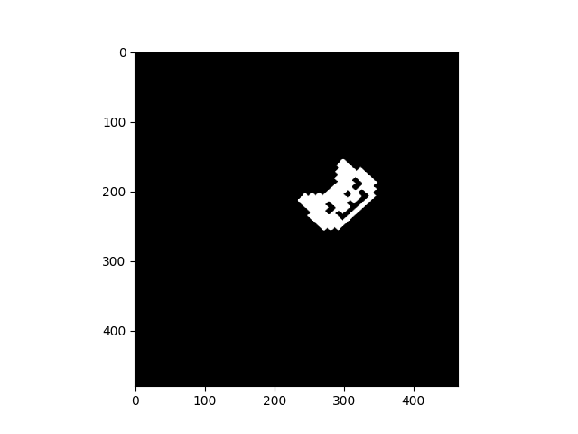
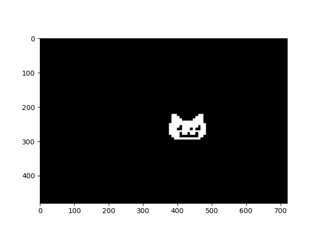

# nyan


nyan (**n**ot **y**our **a**verage **n**ame) is an image pre-processing and post-processing library built on top of 
[Pillow](https://pypi.org/project/Pillow/), [numpy](https://numpy.org/)
[OpenCV-Python](https://opencv-python-tutroals.readthedocs.io/en/latest/py_tutorials/py_tutorials.html), and
[imageio](https://pypi.org/project/imageio/).

The library is designed for Computer Vision tasks, where you (i) pre-process, (ii) perform inference producing bounding 
boxes or segmentation masks, and (iii) transform those results back to the original image space for visualisation with 
the image. 

It is also useful for jointly applying pre-processing to polygons, bounding boxes or segmentation masks and the original
image or video.

**Note: this library is still under development and is incomplete, feel free to experiment with it in it's current
state, but there is a long list of TODOs before the first stable release.**

## TODO
- [x] Implement minimal features for (i) pre-processing, (ii) colour conversions, and (ii) mapping visualisation objects.
- [x] Implement `debug_mode`
- [x] Add minimal README
- [x] Add minimal example for segmentation
- [ ] Add minimal visualisation utilities
- [ ] Complete tests
- [ ] Add documentation
- [ ] Test and/or add support on/for windows and mac
- [ ] First stable release on [PyPi](https://pypi.org/)
- [ ] Add [TFRecords](https://www.tensorflow.org/tutorials/load_data/tf_records) support
- [ ] Add [Keras generator](https://keras.io/preprocessing/image/) support
- [ ] ...

## Installation
To install, simply clone this repository and use [pip](https://pypi.org/project/pip/) to install.
```bash
git clone https://github.com/TWRogers/nyan.git
pip install -e nyan
```

## Example for segmentation
To run the segmentation example, run `example_masks.py`:
```bash
python ./examples/example_masks.py
```

The example takes an example video and performs arbitrary transformations to it, visualising the intermediate steps
using the `debug_mode` feature.



Next, it loads a collection of segmentation masks ...


... and transforms them into the same space as the pre-processed video



Finally, it transforms the mask back to the original space as a sanity check


